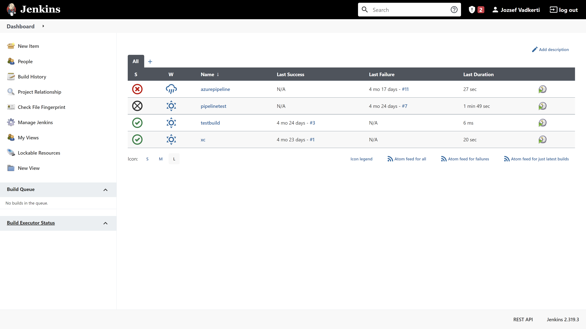
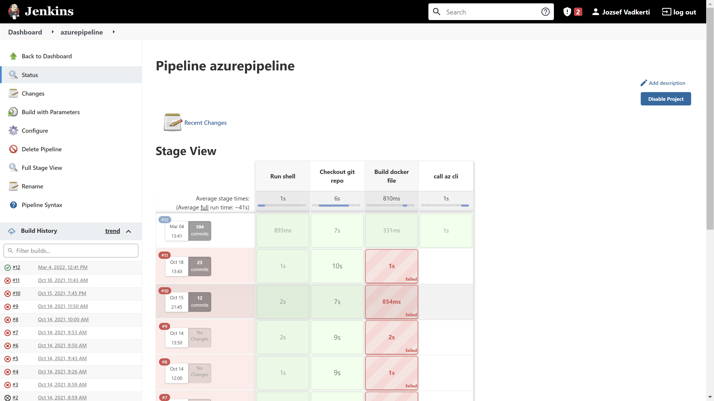
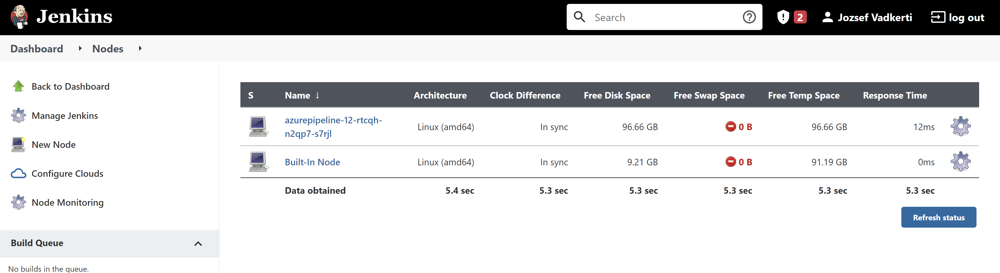
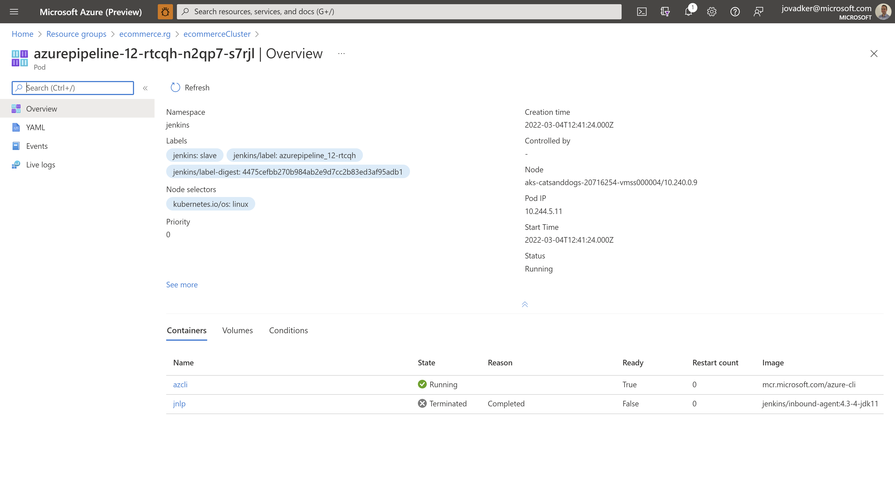
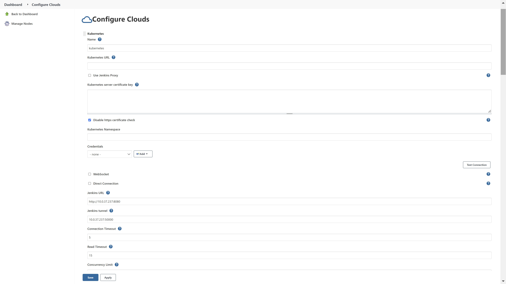
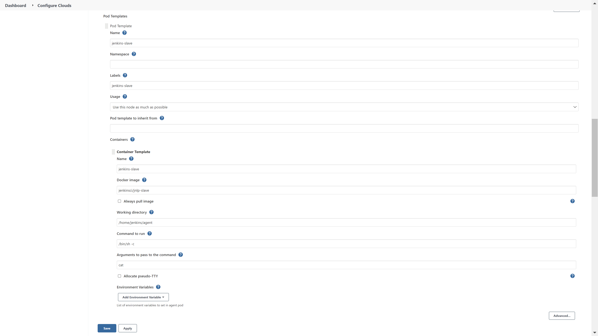

# Introduction

This repository contains Kubernetes specifications to deploy Jenkins server and on-demand Jenkins agents on Azure Kubernetes Service or on any other Kubernetes distros.

**Main business benefit:** embracing the cloud elasticity the overall infrastructure need of this solution is 1/4 of the same approach on pure VMs (IaaS). 

After deploying the solution you will have a Jenkins server accessible through HTTPS on a K8S cluster:

**Executing a pipeline will automatically spin up a new Jenkins Agent provisioned on your K8S cluster:**

**Agent is hold as long as the pipeline runs:**

The corresponding Jenkins Agent pod in Azure looks as follows:


Access to Jenkins server is managed through Azure Active Directory (Jenkins plugin).

---
> [!TIP]
> Scripts are only for demonstrating purposes.

# Getting Started

## **Prerequisites**

- Create an AKS cluster or equivalent
  - See the following repo for details: <https://github.com/jovadker/ecommerceaks> or bring your own cluster
- Introduce an additional agent pool with the label "jenkins:master" and an appropriate VM size, like:
  - D4s_v4 (4 cores, 16 Gig RAM)
  - D2s_v4 (2 cores, 8 Gig RAM)

## **Installation Process**

- K8S YAML specifications are organized in a way that GitOps operators can process them  
- If you don't have a GitOps operator in places, you can use *kubectl* cli to submit the deployments

## **Software dependencies**

- Not applicable

# Build and Test

Here is a step-by-step walkthrough to deploy the solution in your K8S cluster

## 1. Install Nginx ingress controller

```bash

helm upgrade --install nginx-ingress ingress-nginx/ingress-nginx \
    --namespace ingress-nginx \
    --set controller.replicaCount=2 \
    --set controller.nodeSelector."beta\.kubernetes\.io/os"=linux \
    --set defaultBackend.nodeSelector."beta\.kubernetes\.io/os"=linux

```

If you don't have helm, you can install via:

```bash
kubectl apply -f https://raw.githubusercontent.com/kubernetes/ingress-nginx/controller-v1.1.1/deploy/static/provider/cloud/deploy.yaml
```

For further information please visit: 
<https://docs.microsoft.com/en-us/learn/modules/aks-workshop/07-deploy-ingress>

## 2. Install Let's Encrypt cert-manager and create a ClusterIssuer

NGINX ingress controller supports TLS termination and provides several ways to retrieve and configure certificates for HTTPS.
Jetstack's cert-manager provides automatic Let's Encrypt certificate generation and management functionality:

```bash
#!/bin/bash
echo "Let's encrypt"
# Create the namespace for cert-manager
kubectl create namespace cert-manager
# Install the cert-manager 
kubectl apply -f https://github.com/jetstack/cert-manager/releases/download/v1.5.4/cert-manager.yaml
# Install the ClusterIssuer
cat << EOF | kubectl apply -f - 
apiVersion: cert-manager.io/v1
kind: ClusterIssuer
metadata:
  name: letsencrypt-prod
spec:
  acme:
    email: youremailaddress@somewhere.com
    server: https://acme-v02.api.letsencrypt.org/directory
    privateKeySecretRef:
      name: letsencryptprivatekeysecret
    solvers:
     - http01:
        ingress:
         class: nginx
EOF

```

For more details, see <https://docs.microsoft.com/en-us/learn/modules/aks-workshop/08-enable-ssl>

## 3. Deploy cluster roles and cluster role bindings ([jenkins-clusterrole.yaml](./jenkins-config/applications/jenkins-clusterrole.yaml))

These roles and role bindings are required to spin up Jenkins agents on demand by the jenkins "master"

```bash
# Create namespace for jenkins
kubectl apply -f ./jenkins-config/namespaces/jenkins.yaml
# Deploy 
kubectl apply -f ./jenkins-config/applications/jenkins-clusterrole.yaml
```

For more details, see <https://docs.microsoft.com/en-us/learn/modules/aks-workshop/08-enable-ssl>

## 4. Deploy jenkins ([jenkins.yaml](./jenkins-config/applications/jenkins.yaml))

Deploy Jenkins with persistence volume and SSL certificate provided by Let's encrypt:

```bash
# Deploy 
kubectl apply -f ./jenkins-config/applications/jenkins.yaml
```

Please note that you need to query your ingress IP address to add it to the following definition:

```yaml
apiVersion: networking.k8s.io/v1
kind: Ingress
metadata:
  name: jenkins-web-app-ingress
  namespace: jenkins
  annotations:
    kubernetes.io/ingress.class: nginx
    cert-manager.io/cluster-issuer: letsencrypt-prod
    cert-manager.io/acme-challenge-type: http01
spec:
  tls:
  - hosts:
    - frontend.<ingressip>.nip.io
    secretName: jenkins-cert-secret-name

  rules:
  - host: frontend.<ingressip>.nip.io
    http:
      paths:
      - path: /
        pathType: Prefix
        backend:
         service:
          name: jenkins-clusterip-svc
          port: 
           number: 8080

```

Mega-dirty solution is just to apply this yaml file as is, then go to your K8S cluster and query the assigned IP address from your ingress via *kubectl get ingress -A*.
The ideal solution is to create a static IP in your cluster's MC_XXX resource group and use that one during the deployment of nginx ingress controller:

```bash
helm upgrade --install nginx-ingress ingress-nginx/ingress-nginx \
    --namespace ingress-nginx \
    --set controller.replicaCount=2 \
    --set controller.nodeSelector."beta\.kubernetes\.io/os"=linux \
    --set defaultBackend.nodeSelector."beta\.kubernetes\.io/os"=linux \
    --set controller.service.loadBalancerIP="<yourip>"
```

Note: nip, <https://nip.io/> is a dead simple wildcard DNS service for any IP Address.


## 5. Setup Authentication

So far, so good. Now we need to configure our Jenkins to authenticate and authorize only users defined in Azure AD App Registration. For that we need to install a Jenkins plugin: <https://plugins.jenkins.io/azure-ad> 

Setup In Azure Active Directory

 1. Open Azure Active Directory, click App registrations
 2. Click New registration
 3. Add a new Reply URL <https://{your_jenkins_host}/securityRealm/finishLogin>. Make sure "Jenkins URL" (Manage Jenkins => Configure System) is set to the same value as <https://{your_jenkins_host}>.
 4. Click Certificates & secrets, under Client secrets click New client secret to generate a new key, copy the value, it will be used as Client Secret in Jenkins.
 5. Click Authentication, under 'Implicit grant', enable ID tokens.
(optional) To enable AzureAD group support: Click Manifest and modify the "groupMembershipClaims": "None" value to "groupMembershipClaims": "SecurityGroup", then 'Save' it.

## 6. Configure Jenkins

Besides the authentication several other plugins are required to be able to execute Jenkins pipelines. One of the most important is <https://plugins.jenkins.io/kubernetes>. This plugin makes possible spin up Jenkins agents on the fly.

The configuration pages are as follow:

- 
- 
- 

## 7. Pipeline definition

In order to create Jenkins Pipeline (not a Freestyle Project) several additional plugins are required. Detailed instructions can be found here <https://www.jenkins.io/doc/book/pipeline/getting-started/>.
The following pipeline not just uses the on-demand agent, but also injects *az-cli* as container sidecar in order to execute az cli commands during the workflow: 

```javascript
podTemplate (containers: [
    containerTemplate(name: 'azcli', image: 'mcr.microsoft.com/azure-cli', command: 'sleep', args: '99d')
  ], nodeSelector: 'jenkins:master') {
    node(POD_LABEL) {
        stage('Run shell') {
            sh 'echo hello world'
        }
        stage('Checkout git repo') {
            //Fetch Azure DevOps branch
            git branch: 'main', url: params.GIT_REPO, credentialsId: params.GIT_CRED
            // List directories
            def files = findFiles() 
            files.each{ f -> 
                if(f.directory) {
                    echo "This is directory: ${f.name} "
                }
            }
        }
        
        stage('Build docker file') {
             // List directories
            def files = findFiles() 
            files.each{ f -> 
                if(f.directory) {
                    echo "This is directory: ${f.name} "
                }
            }
            container('azcli') {
                    stage('call az cli') {
                        sh 'az acr --help'
                        
                    }
            }
        }
        
    }
}

```

# Contribute

Please feel free to reuse these samples. If you think, there are better approaches to accomplish these jobs, please share with us.
